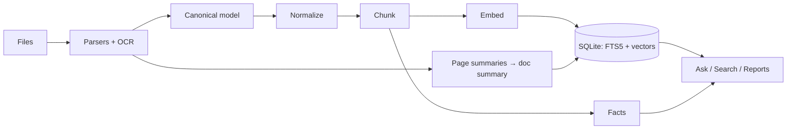

# CMPDI Intelligence

An offline document intelligence platform for geological, mining and
production reporting (SIH26023). It turns scattered PDFs, spreadsheets and
scanned archives into a searchable, cross-validated knowledge base where
every number, answer and generated report carries a receipt back to its
exact source: document, page, table row, or spreadsheet cell.

Everything runs on one machine. No API calls, no cloud, no data leaving the
premises.

> [!TIP]
> Run the demo corpus first: it ingests a digital annual report, a scanned
> geological report, a mixed PDF, a multi-sheet workbook and a parliamentary
> DOCX, and shows how conflicting production figures across sources appear
> side by side in chat answers and the Insights fact explorer.

## Features

- **Workspace UI**: a product landing page, collapsible sidebar navigation
  with Lucide icons, dark and light themes (persisted per machine), and a
  dashboard showing corpus stats, live model status, storage and pipeline
  activity.
- **Ingestion pipeline** with live status: a large drag-and-drop upload zone
  (plus click-to-browse), no-flicker job polling, per-page OCR decisions
  for digital, scanned and mixed PDFs, and a live per-page panel showing
  each page's OCR excerpt alongside its LLM summary as ingestion runs.
- **Document management**: filter by name, type and subsidiary, rename
  documents, inspect full metadata and the normalized representation each
  file became, and preview them properly.
  PDFs render in a real PDF viewer; spreadsheets open as sheet-switchable
  tables; Word documents get a reading view; images show with their OCR text.
  The viewer shows the document summary, a per-page summary section, and
  each page's summary above its extracted content.
- **Search with library filters**: hybrid lexical + semantic results narrowed
  by document type, subsidiary, tag and reporting-period range (accepts
  `2022-23`, `2022` or ISO dates). Organization-wide sections alongside the
  documents: matching numeric facts (each with its receipt), entities,
  locations, metrics and external reference context (labeled as context,
  never evidence).
- **Receipts everywhere**: every fact links through chunk, element, page and
  document back to `data/files/<sha256>/original.*`. Every answer carries
  evidence cards (source, page, location, confidence, View Source), an
  Evidence Quality grade with the checks that justify it (sources,
  independent documents, conflicts, OCR provenance, exact fact match), a
  "Why this answer?" panel showing the reasoning trail, and a link to the
  Conflict Radar when values disagree. Ask can be scoped to one document or
  a selection.
- **Hybrid retrieval**: FAISS cosine search (Gemma-3 family embeddings) and
  SQLite FTS5 BM25, fused with weighted scoring (vector 0.45, lexical 0.25,
  title 0.15, tags 0.10, recency 0.05). Queries are expanded with alternative
  phrasings when an LLM is available.
- **LLM document summaries**: every document gets a summary that is indexed
  as its own chunk, so descriptive queries ("documents about coal
  despatch") find a spreadsheet whose cells never say the words. Every PDF
  page gets its own LLM summary too, each indexed as a searchable
  `PAGE_SUMMARY` chunk and attached to the document summary.
- **Knowledge Tree**: force-directed graph of documents, their extracted tags
  and the entities they mention; subsidiary filter refetches the graph,
  tag sidebar with per-tag search, click any node to inspect it.
- **Grounded chat** with per-claim citations and conversation memory:
  follow-up questions are rewritten into standalone search queries before
  retrieval. Numeric questions resolve against a fact index for exact
  values. The system abstains when evidence is weak instead of guessing.
- **Analytical Ask, one interface**: a single chat over the library. Factual
  questions get cited answers; when a question needs analysis or charts the
  tool-calling agent takes over automatically, running sandboxed Python
  (pandas, numpy, matplotlib) so comparisons, shares and trends are computed,
  never guessed. Its statistical and charting behavior is guided by editable
  docs in `docs/agent/`, and any run can be assembled into a DOCX report
  (markdown converted to real Word tables) with a sources appendix.
- **Automatic tags**: every ingested document gets keywords (Ollama prompt
  with a deterministic term-frequency fallback) used for filtering,
  search boosts and the knowledge tree.
- **Insights**: the fact index made visible: explore any metric (entity ×
  attribute) as a chart where every bar links to its reporting document,
  plus per-document data quality. When documents report the same fact
  differently, chat and reports show all values side by side instead of
  picking one.
- **Data hygiene**: Indian number formats (`1,23,456.78`, lakh/crore), unit
  normalization (MT, lakh tonnes, GCV, %), fiscal-year spans (April start),
  SHA-256 duplicate rejection, automatic version chains with superseded
  revisions excluded from answers.
- **Report generation**: a comprehensive engine extracts the most meaningful
  content the library holds (cleaned prose from the section structure, the
  best-matching extracted tables, cleaned and unit-normalized fact series),
  draws charts from the real numbers (latest-year shares, trends, a long-run
  series mined from the extracted tables), and composes a DOCX with an
  executive summary, real Word tables, verification notes where sources
  disagree, and a per-item sources appendix. Partial-year figures (advance
  releases "up to December") are detected and excluded rather than shown as
  a collapse. Template reports (production summary, comparative analysis,
  parliamentary reply) and agent-run reports share the same receipts and
  markdown-to-Word conversion; templates are built in memory.
- **Settings**: only functional controls (LLM backend and model, Ollama
  endpoint, retrieval depth) with live backend probes; persisted to
  `data/app_settings.json` over the environment defaults.
- **Conflict Radar**: values that disagree on the same entity, metric and
  period are grouped scale-normalized, every value keeps its receipt
  (document, page, OCR flag, superseded state), likely causes are explained
  (partial periods, OCR uncertainty, sibling-row attribution, revised
  figures), and the officer sets the status: open, acknowledged, resolved.
- **Compare Documents**: pick any two documents (version chains suggest the
  natural pair) and see changed numerical facts, facts only in one document,
  and sections added or removed.
- **Report review**: every generated report opens into a review screen with
  per-source verification (current version, OCR flags), retrieval statistics
  for parliamentary drafts, and Approve / Return-for-Revision decisions.
- **Data quality & KPIs**: measured, not decorative: processing success,
  high-confidence OCR share, quarantine-free facts by document type,
  extraction accuracy from the gold-set harness
  (`python -m backend.scripts.eval_extraction`), and real report generation
  times against a stated manual baseline.
- **Demo mode**: one click generates and ingests the curated demonstration
  corpus on a fresh install.
- **Document deletion**: one click removes a document everywhere: FAISS
  vectors, chunks, facts, tags, page images and the stored original.
  Version groups elect a new current document.
- **Topics**: word clouds, keyphrases and document clusters computed locally.
- **LLM optional**: Ollama or raw Transformers when available, extractive
  mode (verbatim evidence, no generation) otherwise. Answers never depend on
  a generative model.

## Quickstart

Requires Python 3.11+ and [uv](https://docs.astral.sh/uv/). OCR works out of
the box through RapidOCR; a Tesseract install is used instead when present.

```bash
uv venv
uv pip install -e .            # or: uv sync
```

Build the React frontend (first run installs dependencies):

```bash
cd frontend && npm install && npm run build && cd ..
```

Initialize, generate the demo corpus, and ingest it:

```bash
python -m backend.scripts.init_system
python -m backend.scripts.make_demo_corpus
python -m backend.scripts.ingest data/demo_corpus
```

Start the app and open http://127.0.0.1:5000:

```bash
python -m backend.app
```

First ingestion downloads the embedding model. On machines without access to
the gated Gemma model, the embedder falls back to bge-small automatically.

> [!NOTE]
> The first run downloads models (embedding, OCR). After that, everything
> runs with the network cable pulled.

## Configuration

All configuration is environment-driven with working defaults.

| Variable | Default | Purpose |
|---|---|---|
| `CMPDI_LLM_PROVIDER` | `auto` | `auto`, `ollama`, `huggingface`, `openai_compatible`, `none` (also settable in Settings; legacy `CMPDI_LLM_BACKEND` still honored) |
| `CMPDI_OLLAMA_MODEL` | `gemma4:31b-cloud` | Model when Ollama is running locally |
| `CMPDI_OLLAMA_URL` | `http://127.0.0.1:11434` | Local Ollama endpoint |
| `CMPDI_HF_MODEL` | _(empty)_ | Local Hugging Face model id or directory (never auto-downloaded) |
| `CMPDI_OPENAI_BASE_URL` | _(empty)_ | OpenAI-compatible endpoint, e.g. `https://inference.example/v1` |
| `CMPDI_OPENAI_MODEL` | _(empty)_ | Model name for the OpenAI-compatible endpoint |
| `CMPDI_OPENAI_API_KEY` | _(empty)_ | API key, environment only — never persisted or logged |
| `CMPDI_EMBEDDING_MODEL` | `google/embeddinggemma-300m` | Embedding model, with automatic fallbacks |
| `CMPDI_OCR_MIN_CONF` | `85` | OCR confidence below which digits are quarantined |
| `CMPDI_DATA_DIR` | `./data` | SQLite database and file store location |

## How It Fits Together

Documents flow one way: parse into a canonical model, normalize, chunk with
structure awareness, embed, index, then extract facts and write summaries.
Nothing downstream ever touches the raw file; the file store is the source
of truth and the indexes are rebuildable.



Full diagrams: [docs/ARCHITECTURE.md](docs/ARCHITECTURE.md).

## Project Layout

```
backend/
  app/          Flask factory (serves the built SPA + JSON API)
  api/
    routes/     screen-data endpoints (pages), JSON mutations (actions),
                file serving (documents, reports), chat, agent,
                conflicts, compare
  core/
    config.py, normalize.py, appsettings.py, compare.py, conflicts.py
    retrieval/    hybrid retrieval, query answering, keyword extraction
    knowledge/    fact index, knowledge graph, topics, document summaries
    llm/          LLM backends, tool-calling agent (+ sandbox runner)
    reporting/    report engine, content selection, charts, markdown→DOCX
    quality/      measured quality/KPI stats and the evidence grader
    pipeline/     ingestion: parsers, OCR, chunking, embeddings
  db/           connection + schema
  models/       canonical document dataclasses
  storage/      content-addressed file store
  scripts/      init, CLI ingest, demo corpus, reindex
frontend/       React SPA (Vite + React Router + Tailwind + Framer Motion)
  src/
    api.js          fetch helpers over the Flask JSON API
    hooks/          theme + sidebar state, page-data fetch, polling,
                    theme-aware canvas colors
    layout/         AppShell: sidebar, mobile frame, footer
    components/     shared UI (page header, rise transitions) and landing
                    sections (hero, showcase, capabilities, FAQ, CTA)
    pages/          one component per screen: landing, dashboard, pipeline,
                    documents, viewer, search, ask, graph, insights,
                    conflicts, compare, topics, reports, review, settings
  public/fonts/  self-hosted Archivo + IBM Plex Mono
  dist/         production build served by Flask (gitignored build output)
docs/
  agent/        editable capability guides fed to the agent's prompts
  ARCHITECTURE.md, PLAN.md
```

Develop the UI with `npm run dev` inside `frontend/` (Vite proxies the API
to port 5000); ship with `npm run build` and restart the Flask app.

## Tested Against Real Data

The library ingests and answers over live documents from
[coal.gov.in](https://coal.gov.in): annual report chapters (digital pages
plus image-only pages through OCR) and the Coal Directory statistics
workbooks (multi-sheet, hundreds of table regions, thousands of numeric
cells). Drop any of them into `samples/` and ingest:

```bash
python -m backend.scripts.ingest samples
```

Fact extraction on statistical sheets applies noise guards (footnote
markers, date cells, year spans, computed high-precision values) and
plausibility bands per attribute (ash cannot exceed 100%, GCV lives in a
known kcal/kg band), so the fact index holds reported figures rather than
spreadsheet arithmetic.

## Known Limitations

- Single-user; no authentication.
- Heavily degraded scans reduce fact extraction quality; low-confidence
  digits are flagged rather than trusted.
- Table detection targets ruled tables, which official reports use;
  borderless layouts are best effort.
- Documents ingested before the tag/enrichment upgrade need
  `python -m backend.scripts.reindex` to gain tags and enriched embeddings.
