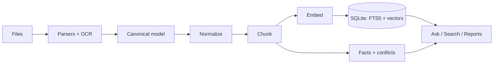

# CMPDI Intelligence

An offline document intelligence platform for geological, mining and
production reporting (SIH26023). It turns scattered PDFs, spreadsheets and
scanned archives into a searchable, cross-validated knowledge base where
every number, answer and generated report carries a receipt back to its
exact source: document, page, table row, or spreadsheet cell.

Everything runs on one machine. No API calls, no cloud, no data leaving the
premises.

> [!TIP]
> Run the demo corpus first: it ingests a digital annual report, a scanned
> geological report, a mixed PDF, a multi-sheet workbook and a parliamentary
> DOCX, and plants a data conflict you can watch the Conflict Radar catch.

## Features

- **Ingestion pipeline** with live status: classify, parse, OCR, normalize,
  chunk, embed, index. Digital, scanned and mixed PDFs are decided per page.
- **Receipts everywhere**: every fact links through chunk, element, page and
  document back to `data/files/<sha256>/original.*`. Click a figure in a
  generated report to open the exact source location.
- **Hybrid retrieval**: FAISS cosine search (Gemma-3 family embeddings) and
  SQLite FTS5 BM25, fused with weighted scoring (vector 0.45, lexical 0.25,
  title 0.15, tags 0.10, recency 0.05). Queries are expanded with alternative
  phrasings when an LLM is available.
- **Knowledge Tree**: force-directed graph of documents, their extracted tags
  and the entities they mention; tag sidebar with per-tag search.
- **Grounded chat** with per-claim citations and conversation memory:
  follow-up questions are rewritten into standalone search queries before
  retrieval. Numeric questions resolve against a fact index for exact
  values. The system abstains when evidence is weak instead of guessing.
- **Automatic tags**: every ingested document gets keywords (Ollama prompt
  with a deterministic term-frequency fallback) used for filtering,
  search boosts and the knowledge tree.
- **Conflict Radar**: documents that disagree about the same fact, side by
  side, each value linked to its source. Humans resolve; the decision and
  note are recorded.
- **Data hygiene**: Indian number formats (`1,23,456.78`, lakh/crore), unit
  normalization (MT, lakh tonnes, GCV, %), fiscal-year spans (April start),
  SHA-256 duplicate rejection, automatic version chains with superseded
  revisions excluded from answers.
- **Report Studio**: template-driven DOCX output (production summary,
  comparative analysis, parliamentary reply) with conflict flags, sources
  appendix, and human-approval workflow. Templates are built in memory;
  no artifacts ship with the code.
- **Document deletion**: one click removes a document everywhere: FAISS
  vectors, chunks, facts, tags, open conflicts that cite it, page images
  and the stored original. Version groups elect a new current document.
- **Topics**: word clouds, keyphrases and document clusters computed locally.
- **LLM optional**: Ollama or raw Transformers when available, extractive
  mode (verbatim evidence, no generation) otherwise. Answers never depend on
  a generative model.

## Quickstart

Requires Python 3.11+ and [uv](https://docs.astral.sh/uv/). OCR works out of
the box through RapidOCR; a Tesseract install is used instead when present.

```bash
uv venv
uv pip install -e .            # or: uv sync
```

Initialize, generate the demo corpus, and ingest it:

```bash
python -m backend.scripts.init_system
python -m backend.scripts.make_demo_corpus
python -m backend.scripts.ingest data/demo_corpus
```

Start the app and open http://127.0.0.1:5000:

```bash
python -m backend.app
```

First ingestion downloads the embedding model. On machines without access to
the gated Gemma model, the embedder falls back to bge-small automatically.

> [!NOTE]
> The first run downloads models (embedding, OCR). After that, everything
> runs with the network cable pulled.

## Configuration

All configuration is environment-driven with working defaults.

| Variable | Default | Purpose |
|---|---|---|
| `CMPDI_LLM_BACKEND` | `auto` | `auto`, `ollama`, `transformers` or `extractive` |
| `CMPDI_OLLAMA_MODEL` | `qwen3:4b` | Model when Ollama is running locally |
| `CMPDI_LLM_MODEL` | `Qwen/Qwen3-1.7B` | HF model for the Transformers backend |
| `CMPDI_EMBEDDING_MODEL` | `google/embeddinggemma-300m` | Embedding model, with automatic fallbacks |
| `CMPDI_OCR_MIN_CONF` | `85` | OCR confidence below which digits are quarantined |
| `CMPDI_DATA_DIR` | `./data` | SQLite database and file store location |

## How It Fits Together

Documents flow one way: parse into a canonical model, normalize, chunk with
structure awareness, embed, index, then extract facts and detect conflicts.
Nothing downstream ever touches the raw file; the file store is the source
of truth and the indexes are rebuildable.



Full diagrams: [ARCHITECTURE.md](ARCHITECTURE.md).

## Project Layout

```
backend/
  app/          Flask factory
  api/routes/   ingest, documents, search, ask, conflicts, topics, reports
  core/         pipeline, retrieval, facts, query, keywords, graph, llm,
                topics, reports
  db/           connection + schema
  models/       canonical document dataclasses
  storage/      content-addressed file store
  scripts/      init, CLI ingest, demo corpus
frontend/
  templates/    pages/ and components/
  static/       vendored Tailwind, self-hosted fonts, app.js
```

## Known Limitations

- Single-user; no authentication.
- Heavily degraded scans reduce fact extraction quality; low-confidence
  digits are flagged rather than trusted.
- Table detection targets ruled tables, which official reports use;
  borderless layouts are best effort.
- Documents ingested before the tag/enrichment upgrade need
  `python -m backend.scripts.reindex` to gain tags and enriched embeddings.
