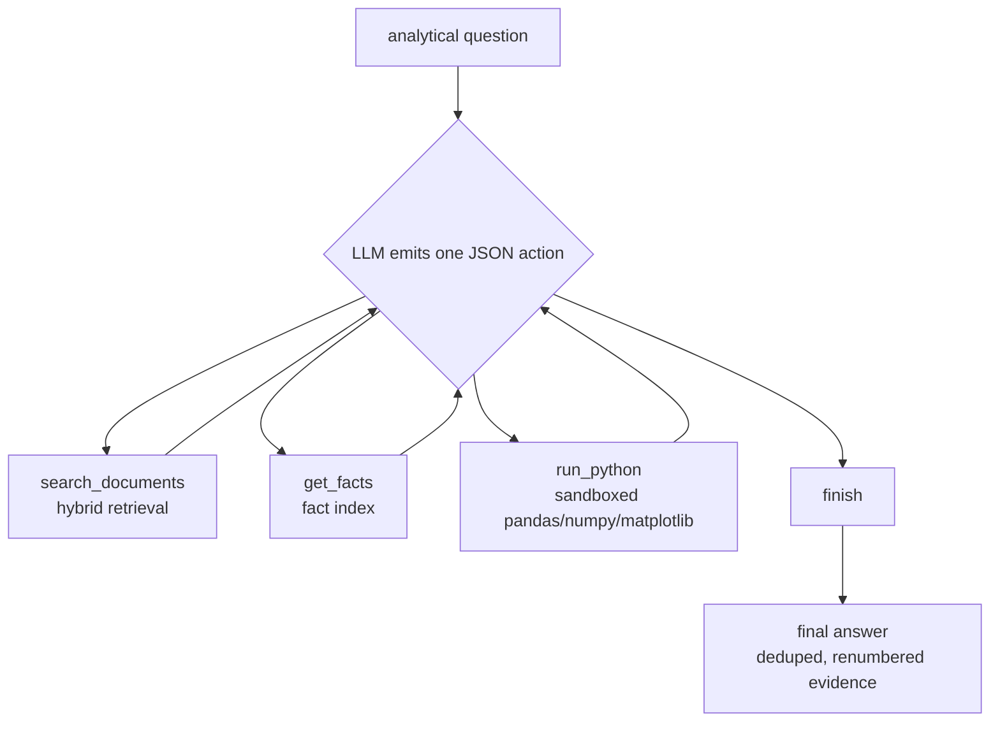

# Analytical Agent & Report Generation

Factual questions get cited answers ([RETRIEVAL.md](RETRIEVAL.md)). When a
question needs computation or charts, the tool-calling agent takes over inside
the same Ask thread; its runs — and the template engines — can be assembled
into DOCX reports behind a human review gate.

Code: `backend/core/llm/` (`agent.py`, `tools.py`, `agent_runner.py`,
`providers.py`), `backend/core/reporting/` (`engine.py`, `director.py`,
`plan.py`, `analyst.py`, `content.py`, `charts.py`, `evidence.py`,
`workspace.py`, `skills.py`, `auditor.py`, `md_docx.py`).

## Agent loop

A model-agnostic ReAct loop (`MAX_STEPS = 8`). `/api/chat` routes analytical
intent to it automatically; `/api/agent` runs it directly.

- The Python tool spawns an isolated runner process (60s budget) with
  preloaded `pandas`/`numpy`/`matplotlib` plus `load_table()` / `load_facts()`
  readers, restricted builtins (no `open`, `exec`, `eval`, `compile`), and a
  static AST import scan rejecting network/system modules. Charts save to
  `data/agent_runs/<run_id>/` with continuous figure numbering; runs persist
  for download (`POST /api/agent/report {run_id}`).
- Statistical and charting behavior is guided by the editable
  [agent/statistics.md](agent/statistics.md) and [agent/charts.md](agent/charts.md)
  guides, loaded into the system prompt — adjust the guides and the agent's
  methods follow without code changes.
- LLM backends (`providers.py`): Ollama → OpenAI-compatible → local Hugging
  Face → extractive. In extractive mode the agent degrades to `query.answer()`.

## Report engines

Two paths share receipts and markdown→Word conversion (`md_docx.py`, so
markdown tables become real Word tables and no markdown syntax reaches the
document):

- **Comprehensive engine** (`engine.py`, deterministic): narrative from
  deduplicated element prose, best-matching extracted tables as real Word
  tables, unit-normalized fact series (tonnes ×1e-6, lakh tonnes ×0.1;
  capacities/percentages excluded), charts in one visual style (latest-year
  shares, grouped bars for short series, lines from 3+ points), partial-year
  figures ("up to December") detected and excluded, verification notes where
  sources disagree, per-item sources appendix.
- **Planner path** (`director.py`, `plan.py`, `analyst.py`, …): budgeted
  `SIMPLE / MODERATE / COMPLEX` orchestration — context → plan → research →
  analysis → charts → DOM → audit → revise → DOCX — with an `EvidenceGraph`
  binding every claim to its source.
- **Templates** (production summary, comparative analysis, parliamentary
  reply): in-memory docxtpl builds from the fact index, same receipts.

Assembly order is always Question → Fact Retrieval → Semantic Retrieval →
Validation → Conflict Detection → Assembly → Provenance → Human Review →
Final. Every paragraph, table and figure carries a numbered source receipt.

## Human review

Every generated report opens in `/reports/:rid` with per-source verification
(current version, OCR flags), retrieval statistics for parliamentary drafts,
and Approve / Return-for-Revision decisions persisted on the `reports` row
(`human_approved`). Only approved reports are official.

Next: [FRONTEND.md](FRONTEND.md) (Ask, Reports, Review screens),
[OPERATIONS.md](OPERATIONS.md) (running generation locally).
