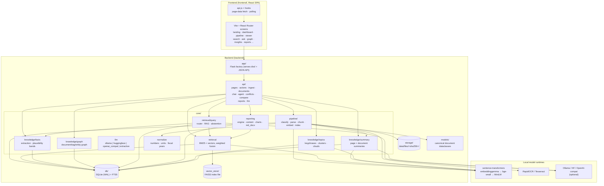
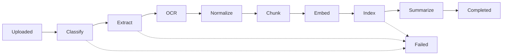
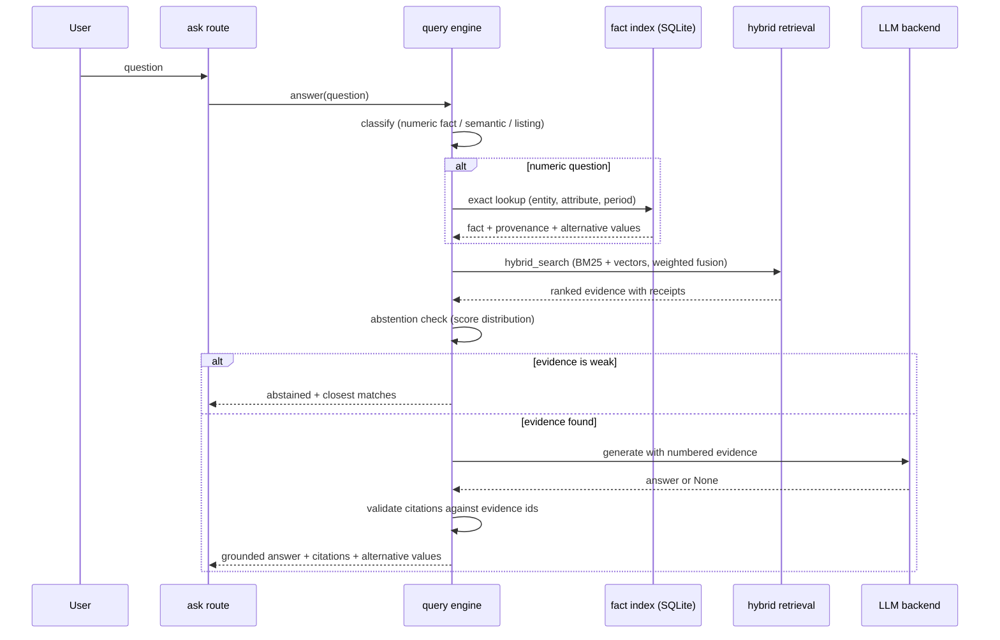
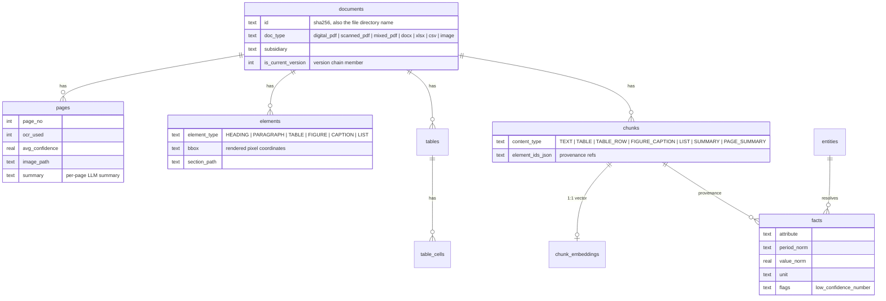
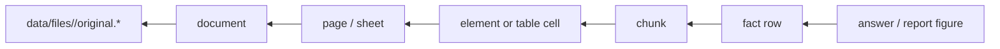
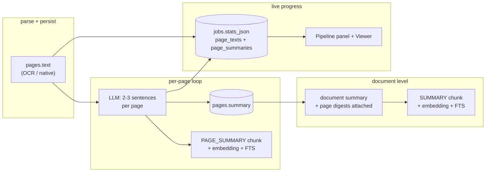

# Architecture

CMPDI Intelligence is a two-part application: a Python backend that owns all
processing and data, and a React single-page frontend served by that backend.
One SQLite file plus one file directory hold the entire system state. The
application runs fully offline.

## System Overview



## Ingestion Pipeline

Every document moves through the same stage machine. The worker thread
consumes a job queue backed by the `jobs` table so the UI stays responsive.



Stage behavior:

| Stage | What happens |
|---|---|
| Classify | Magic-byte detection; digital vs scanned vs mixed PDF is refined per page |
| Extract | PyMuPDF for digital pages, python-docx / openpyxl / csv for office files |
| OCR | RapidOCR (or Tesseract) on pages with too little text; word confidences kept |
| Normalize | Indian number formats, lakh/crore, unit dictionary, fiscal-year spans |
| Chunk | Structure-aware: section-bound text, whole tables or self-describing row chunks |
| Embed | Local sentence-transformers model; vectors stored as float32 BLOBs |
| Index | Rows in SQLite + FTS5; fact extraction with noise guards and plausibility bands runs here |
| Summarize | Per-page LLM summaries first (each page → LLM → `pages.summary` + embedded `PAGE_SUMMARY` chunk, progress streamed to the job feed), then the document summary with the page digests attached, indexed as a `SUMMARY` chunk |

## Retrieval Fusion

Candidates come from three layers and merge into one weighted score:

| Signal | Weight | Source |
|---|---|---|
| Vector similarity | 0.45 | FAISS IndexFlatIP on L2-normalized vectors (inner product = cosine) |
| BM25 | 0.25 | SQLite FTS5, augmented with LLM query expansions |
| Title match | 0.15 | Query terms present in the document filename/title |
| Tag match | 0.10 | Query terms against extracted keywords |
| Recency | 0.05 | Exponential decay on document date |

The FAISS index persists to `data/faiss_index.bin` (an `IndexIDMap2` over
`IndexFlatIP`, keyed by chunk id). A dimension mismatch with the stored
embeddings triggers an automatic rebuild.

Tags come from a dual-layer extractor at ingestion time: an Ollama prompt
when a generative model is available, a deterministic term-frequency
fallback otherwise. Tags drive document filtering, the search boost, and
the knowledge tree.

Library filters apply inside both retrieval layers before scoring: document
type, subsidiary, tag, and a reporting-period range (`doc_from`/`doc_to`,
normalized to ISO dates, so `2022-23` and `2022` both work).

## Organization Search

`/search` (and `/api/search/organization`) returns the hybrid document
results plus five read-only sections assembled from the existing knowledge
layer (`core/retrieval/org_search.py`, no new extraction or schema):
numeric facts matching the query's entity/attribute/period (each with its
chunk → page → document receipt), matching entities (organization kind via
`relations.kind_of`, with fact/document/reference counts), locations
(`location | coalfield | block` entities), metrics (attribute matches with
corpus counts and a sample receipt), and external reference rows labeled
`origin: "reference"` — context, never evidence. Subsidiary/type filters
scope the document and fact sections; the entity, location, metric and
reference sections are corpus-wide roll-ups.

## Knowledge Graph

`/knowledge` renders a force-directed canvas of seven node kinds: documents
(amber), organizations (violet), mines (blue), locations (teal), geology
(ochre), metrics (pink) and events (red), plus extracted tags (green).
Persisted evidence edges (`kg_edges`, built deterministically at ingestion
by `knowledge/relations`) carry OPERATES / LOCATED_IN / BASED_IN /
HAS_GEOLOGY / MENTIONS / OCCURRED_AT / INVOLVES / REPORTED_IN with chunk →
page → document provenance; HAS_METRIC / REPORTS_METRIC / version
SUPERSEDES links derive at query time from the fact index so the graph never
duplicates it. Reference context (`entity_reference`) never enters the graph.
The subsidiary/kind/query filters refetch the slice and clear the selection;
the simulation loop and listeners are torn down on every reload so no stale
frames survive. Clicking a node opens its one-hop neighbourhood
(`/api/graph/node`) with per-edge receipts, and the tag sidebar links every
tag to a filtered search.

## External Knowledge Layer

Entity nodes carry more than a label. `backend/core/knowledge/` holds a
curated, locally bundled reference dataset (`reference_data.py`: subsidiary
profiles, operating geography, dated public production and sector
statistics) seeded idempotently into `entity_reference` at init and app
startup. The service (`reference.py`) joins it to organizational entities
and serves it as `origin: "reference"` alongside the entity's library
footprint (`origin: "evidence"`). Clicking an entity node shows both: HQ,
states, coalfields and sourced public figures first, then what the
ingested documents say. Reference values are context, never evidence —
they never enter the fact index, conflicts, answers or reports, so the
offline-first pledge holds: no network calls, staleness visible via
per-row source and as-of dates.

## Asset Intelligence

`/assets` gives every mine, coalfield, block and location a unified profile
(`core/knowledge/assets.py`, read-only over the fact index, Conflict Radar
and reference layer — no new extraction). Each profile shows latest key
figures with receipts, median-per-period MT trends, mentioning documents
(superseded struck through), related operators/places/geology by
shared-document co-occurrence, open conflicts, and the recent evidence table;
every value deep-links into the Source Viewer. The list endpoint
(`/api/assets`, with `kind=mine|region` and `q` filters) orders assets by
fact count so the most-reported mines surface first.

## Chat

Ask (`/ask`) is the single conversation surface. The client sends the full
message list to `/api/chat`; the backend rewrites follow-up questions ("which
document says that?") into standalone queries using the history, then routes:

- **Factual and lookup questions** run the grounded RAG path: numeric
  questions resolve deterministically from the fact index (the composed
  answer quotes the extracted value and its receipt; no LLM step can alter
  it), open questions retrieve and generate with numbered evidence.
- **Analytical questions** (compare, trend, share, rank, "generate a few
  charts", ...) route to the tool-calling agent automatically. Its trace,
  charts and evidence render inline in the same thread.

Extractive mode keeps the same contract with no LLM installed.

## Query Flow



LLM provider resolution (`CMPDI_LLM_PROVIDER`, also settable in Settings):
`ollama` when the local server answers, then a configured OpenAI-compatible
endpoint, then a locally cached Hugging Face model, then extractive mode
(verbatim evidence, no generation). Generation never blocks an answer.

## Data Model



Provenance chain for any derived value:



## Fact Verification

Facts group by `(entity, attribute, period, unit)`. When the same fact key
carries differing values across documents, the system shows every value
with its receipt rather than choosing one: chat answers attach an
"also reported elsewhere" note, reports flag the slot for verification,
and the Insights fact explorer plots each reported value per period.

## Document and Page Summaries

The `summarizing` stage works bottom-up. First every page goes to the
configured LLM for a 2-3 sentence summary (`summarize_page_text`, capped at
`MAX_LLM_PAGES` pages so very long PDFs stay tractable; the rest keep an
extractive first-sentences fallback, as does everything when the backend is
extractive). Each summary is stored on `pages.summary` and indexed as its
own `PAGE_SUMMARY` chunk — embedded with the same metadata envelope as
content chunks — so page-level semantics are searchable alongside everything
else. Then the document summary (4-6 sentences) is generated with the page
digests in its prompt, and the digests are appended to it, so the main
summary carries the per-page detail.

Progress streams live: after parsing, the raw OCR/native text per page lands
in the job's `stats_json` (`page_texts`); each finished page summary is
appended to `page_summaries` with a `pages_done/pages_total` counter. The
Pipeline screen polls `/api/jobs` and shows a collapsible per-page panel
(OCR excerpt + LLM summary), and the Viewer shows each page's summary above
its extracted content plus a document-wide Page Summaries section.



## Agent

A model-agnostic ReAct loop living behind the unified Ask interface
(`/api/chat` routes to it on analytical intent; `/api/agent` runs it
directly). Each turn the LLM emits one JSON action:
`search_documents` (hybrid retrieval), `get_facts` (fact index), or
`run_python`. The Python tool spawns an isolated runner process with a
60-second budget; user code gets preloaded pandas/numpy/matplotlib plus
`load_table()`/`load_facts()` readers over SQLite, restricted builtins
(no `open`, `exec`, `eval`, `compile`), and a static AST import scan that
rejects network and system modules. Successive calls number their charts
continuously so figures never overwrite each other; every matplotlib figure
is captured to `data/agent_runs/<run_id>/` and shown in the trace. The
final answer cites numbered evidence entries that are deduplicated and
renumbered to match the returned receipts, and any run can be assembled
into a DOCX report.

The agent's statistical and charting behavior is described in two editable
markdown guides, `docs/agent/statistics.md` and `docs/agent/charts.md`,
loaded into the system prompt at startup: adjust the guides and the agent's
methods follow without code changes.

## Report Generation

Template reports (production summary, comparative analysis, parliamentary
reply) fill docxtpl templates built in memory from the fact index; their
narrative comes from the cleaned element structure rather than raw retrieval
snippets. Agent runs compose the answer and evidence as markdown.

The comprehensive engine (`backend/core/reporting/engine.py`) builds a full
report from three extraction layers in `content.py` (imported as
`report_content`):

- **Narrative**: deduplicated prose blocks from the element structure,
  number-grid junk filtered, scored on topic coverage and capped per section.
- **Tables**: extracted tables scored on keyword hits and numeric density,
  rendered as real Word tables; numbered first rows like `(1)(2)(3)` promote
  their following row to header; the longest year-wise Quantity column can
  be mined as a multi-year chart series.
- **Facts**: cleaned series per attribute with unit normalization to MT
  (`tonnes` values scale by 1e-6, lakh tonnes by 0.1, capacities and
  percentages excluded), entity resolution via canonical name or raw
  mention, and per-entity partial-year detection (a trailing fiscal year
  that collapses against the previous one, typical of advance releases
  "up to December", is excluded from tables, charts and highlights).

Charts (`charts.py`, imported as `report_charts`) are drawn from the cleaned series in one visual
style: latest-year shares with percentage labels, per-year grouped bars for
short series, lines only from three points up. All report text is composed
as markdown and converted by `md_docx.py` (`markdown` + `htmldocx`), so
markdown tables become real Word tables and no markdown syntax reaches the
document. Every paragraph, table and figure carries a numbered source
receipt, and keys with multiple reported values surface in Verification
Notes instead of being silently averaged.

## Frontend

React SPA (Vite + React Router + Tailwind), built to `frontend/dist/` and
served by Flask; `npm run dev` proxies the API to port 5000 during
development. The design system is a paper/ink/amber palette with Archivo
text and IBM Plex Mono numbers, dark and light themes persisted per
machine, Lucide icons, and a collapsible sidebar (`AppShell`). Screens
fetch initial state from `/api/pages/*` and poll live endpoints
(`/api/jobs` for the pipeline strip with its per-page OCR/summary panel,
`usePolling` elsewhere). The Knowledge Tree (`pages/Graph.jsx`) is a
force-directed canvas with hover/drag/select and a node inspector panel;
the Viewer (`pages/Viewer.jsx`) shows document + per-page summaries beside
the PDF preview and extraction.

## Directory Layout

```
backend/
  app/          Flask factory, blueprint registration (serves dist/ + JSON API)
  api/          pages (screen data), actions (mutations), ingest (jobs feed),
                documents, chat, agent, conflicts, compare, reports, llm
  core/         config, normalization, appsettings; subpackages:
                pipeline (ingestion incl. per-page summaries), retrieval
                (search + query), knowledge (facts, graph, topics, summaries),
                llm (backends, agent + sandbox runner),
                reporting (engine, content, charts, director, md_docx),
                quality (trust grading)
  db/           SQLAlchemy models, connection, schema.sql + migrations
  models/       canonical document dataclasses
  storage/      content-addressed file store
  scripts/      init, CLI ingestion, demo corpus generator, reindex
frontend/       React SPA (Vite + React Router + Tailwind + motion)
  src/
    api.js, hooks/, layout/, components/, pages/ (one per screen)
    pages/landing/sections/  landing content sections
  dist/         production build served by Flask (gitignored build output)
docs/
  agent/        statistics.md and charts.md capability guides for the agent
```
