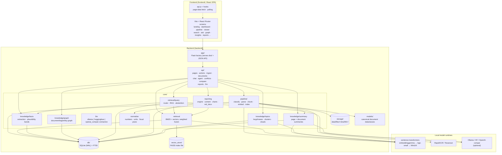
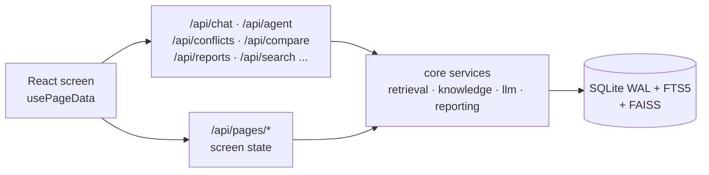
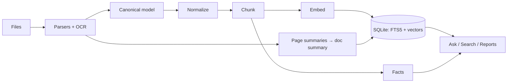

# Architecture

CMPDI Intelligence is a two-part application: a Python backend that owns all
processing and data, and a React single-page frontend served by that backend.
One SQLite file plus one file directory hold the entire system state. The
application runs fully offline.

Study order: this overview → [DATA_MODEL.md](DATA_MODEL.md) →
[PIPELINE.md](PIPELINE.md) → [RETRIEVAL.md](RETRIEVAL.md) →
[KNOWLEDGE.md](KNOWLEDGE.md) → [AGENT_AND_REPORTS.md](AGENT_AND_REPORTS.md) →
[FRONTEND.md](FRONTEND.md) → [OPERATIONS.md](OPERATIONS.md).

## System overview



## Request path

Routes stay thin: validate input → call the service → return the result
(`Route → Service → Repository/Domain → Database/Storage`). The factory
(`backend/app/__init__.py:create_app()`) initializes the DB, seeds subsidiary
entities and reference data, starts the ingestion worker, mounts the 15 API
blueprints (`backend/api/__init__.py:ALL_BLUEPRINTS`), and serves
`frontend/dist/` with a history-API fallback. Screen data comes from
`GET /api/pages/<screen>`; mutations live under `/api/actions`, `/api/ingest`
and per-domain endpoints (chat, agent, conflicts, compare, reports, …).



## Data flow

Documents flow one way: parse into a canonical model, normalize, chunk with
structure awareness, embed, index, then extract facts and write summaries.
Nothing downstream ever touches the raw file; the file store is the source of
truth and the indexes are rebuildable.



## Layer guides

| Layer | Guide | Core modules |
|---|---|---|
| Persistence | [DATA_MODEL.md](DATA_MODEL.md) | `db/`, `storage/`, `models/` |
| Ingestion | [PIPELINE.md](PIPELINE.md) | `core/pipeline/`, `core/normalize.py` |
| Search & Q&A | [RETRIEVAL.md](RETRIEVAL.md) | `core/retrieval/`, `core/quality/` |
| Structured knowledge | [KNOWLEDGE.md](KNOWLEDGE.md) | `core/knowledge/`, `core/conflicts.py`, `core/compare.py`, `core/insights.py`, `core/temporal.py` |
| Analysis & reports | [AGENT_AND_REPORTS.md](AGENT_AND_REPORTS.md) | `core/llm/`, `core/reporting/` |
| UI | [FRONTEND.md](FRONTEND.md) | `frontend/src/` |
| Run & configure | [OPERATIONS.md](OPERATIONS.md) | `run.sh`, `backend/scripts/`, `core/config.py` |

## Directory layout

```text
backend/
  app/          Flask factory, blueprint registration (serves dist/ + JSON API)
  api/          pages (screen data), actions (mutations), ingest (jobs feed),
                documents, chat, agent, conflicts, compare, reports, llm
  core/         config, normalization, appsettings; subpackages:
                pipeline (ingestion incl. per-page summaries), retrieval
                (search + query), knowledge (facts, graph, topics, summaries),
                llm (backends, agent + sandbox runner),
                reporting (engine, content, charts, director, md_docx),
                quality (trust grading)
  db/           SQLAlchemy models, connection, schema.sql + migrations
  models/       canonical document dataclasses
  storage/      content-addressed file store
  scripts/      init, CLI ingestion, demo corpus generator, reindex
frontend/       React SPA (Vite + React Router + Tailwind + motion)
  src/
    api.js, hooks/, layout/, components/, pages/ (one per screen)
    pages/landing/sections/  landing content sections
  dist/         production build served by Flask (gitignored build output)
docs/
  README.md     documentation map + study path
  agent/        statistics.md and charts.md capability guides for the agent
```
