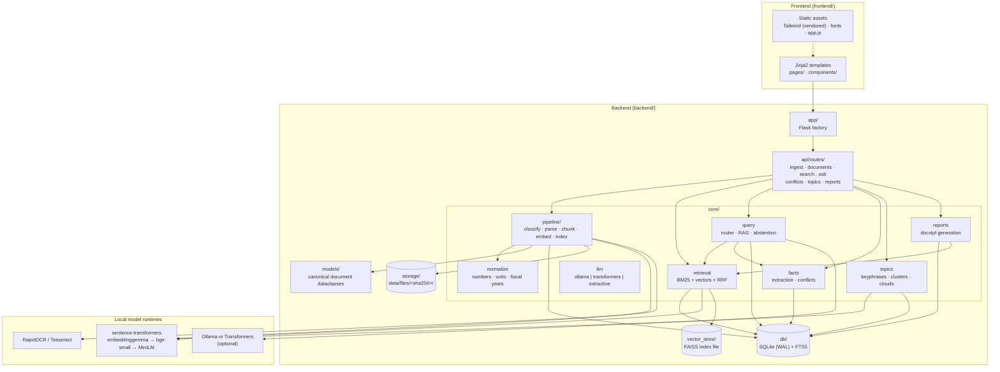
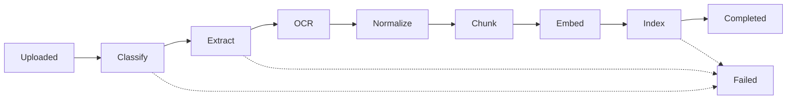
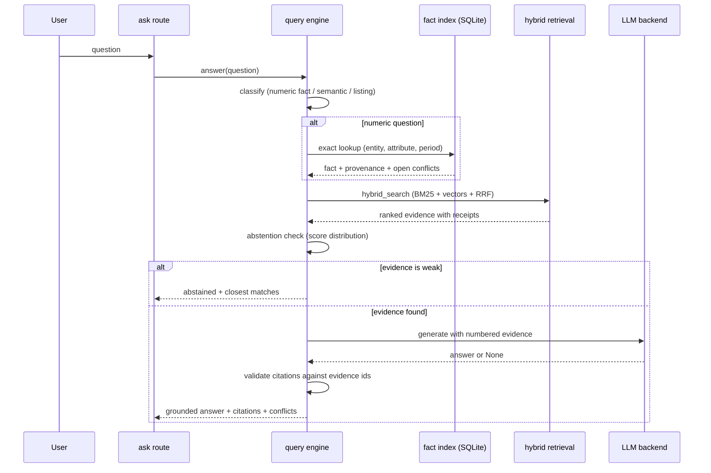
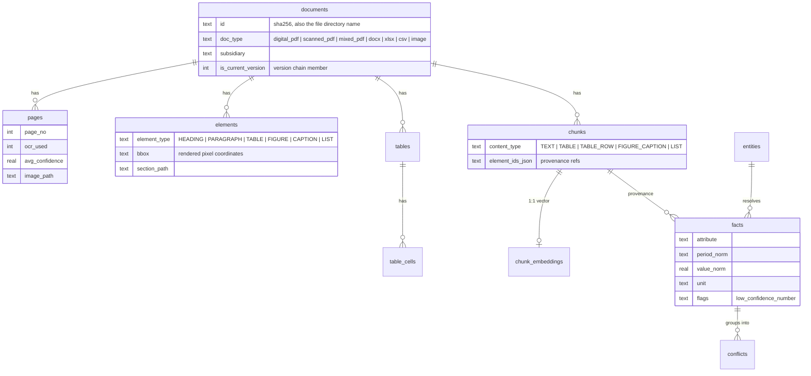
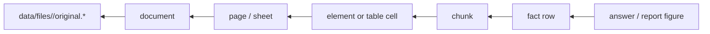

# Architecture

CMPDI Intelligence is a two-part application: a Python backend that owns all
processing and data, and a Jinja/HTML frontend served by that backend. One
SQLite file plus one file directory hold the entire system state. The
application runs fully offline.

## System Overview



## Ingestion Pipeline

Every document moves through the same stage machine. The worker thread
consumes a job queue backed by the `jobs` table so the UI stays responsive.



Stage behavior:

| Stage | What happens |
|---|---|
| Classify | Magic-byte detection; digital vs scanned vs mixed PDF is refined per page |
| Extract | PyMuPDF for digital pages, python-docx / openpyxl / csv for office files |
| OCR | RapidOCR (or Tesseract) on pages with too little text; word confidences kept |
| Normalize | Indian number formats, lakh/crore, unit dictionary, fiscal-year spans |
| Chunk | Structure-aware: section-bound text, whole tables or self-describing row chunks |
| Embed | Local sentence-transformers model; vectors stored as float32 BLOBs |
| Index | Rows in SQLite + FTS5; fact extraction and conflict detection run here |

## Retrieval Fusion

Candidates come from three layers and merge into one weighted score:

| Signal | Weight | Source |
|---|---|---|
| Vector similarity | 0.45 | FAISS IndexFlatIP on L2-normalized vectors (inner product = cosine) |
| BM25 | 0.25 | SQLite FTS5, augmented with LLM query expansions |
| Title match | 0.15 | Query terms present in the document filename/title |
| Tag match | 0.10 | Query terms against extracted keywords |
| Recency | 0.05 | Exponential decay on document date |

The FAISS index persists to `data/faiss_index.bin` (an `IndexIDMap2` over
`IndexFlatIP`, keyed by chunk id). A dimension mismatch with the stored
embeddings triggers an automatic rebuild.

Tags come from a dual-layer extractor at ingestion time: an Ollama prompt
when a generative model is available, a deterministic term-frequency
fallback otherwise. Tags drive document filtering, the search boost, and
the knowledge tree.

## Knowledge Tree

`/graph` renders a force-directed canvas of three node types: documents
(amber), extracted tags (green) and entities resolved from the fact index
(blue). Edges connect each document to its tags and entities, so one topic
reported across many files forms a dense cluster. The tag sidebar links
every tag to a filtered search.

## Chat

The Ask page is a conversation. The client sends the full message list to
`/api/chat`; the backend rewrites follow-up questions ("which document says
that?") into standalone queries using the history, retrieves, and grounds
the reply with citations. Extractive mode keeps the same contract with no
LLM installed.

## Query Flow



LLM backend resolution: `ollama` if configured and running, then a cached
Transformers model, then extractive mode (verbatim evidence, no generation).
Generation never blocks an answer.

## Data Model



Provenance chain for any derived value:



## Fact Verification

Facts group by `(entity, attribute, period, unit)`. When the same fact key
carries differing values across documents, the system shows every value
with its receipt rather than choosing one: chat answers attach an
"also reported elsewhere" note, reports flag the slot for verification,
and the Insights fact explorer plots each reported value per period.

## Document Summaries

The last pipeline stage asks the LLM for a 4-6 sentence summary of each
document (deterministic fallback without a backend). The summary is stored
on the document and indexed as its own `SUMMARY` chunk, embedded with the
same metadata envelope as content chunks. Descriptive queries therefore
reach spreadsheets and scans whose raw cells never contain the query words.

## Agent

A model-agnostic ReAct loop. Each turn the LLM emits one JSON action:
`search_documents` (hybrid retrieval), `get_facts` (fact index), or
`run_python`. The Python tool spawns an isolated runner process with a
60-second budget; user code gets preloaded pandas/numpy/matplotlib plus
`load_table()`/`load_facts()` readers over SQLite, restricted builtins
(no `open`, `exec`, `eval`, `compile`), and a static AST import scan that
rejects network and system modules. Every matplotlib figure is captured to
`data/agent_runs/<run_id>/` and shown in the trace. The final answer cites
numbered evidence entries that are deduplicated and renumbered to match the
returned receipts, and any run can be assembled into a DOCX report.

## Frontend

Server-rendered Jinja templates styled with Tailwind (vendored locally, no
build step). The design system lives in the Tailwind config inside
`frontend/templates/base.html`: Archivo for text, IBM Plex Mono for numbers
and labels, a paper/ink/amber palette. Every palette step is a CSS variable
that flips under `.dark`, so dark mode re-themes the whole UI (canvas
visuals included) without per-template overrides; the choice persists in
`localStorage`. Navigation is a collapsible sidebar. `app.js` polls
`/api/jobs` for the live pipeline strip. No custom CSS file ships with the
project.

## Directory Layout

```
backend/
  app/          Flask factory, blueprint registration
  api/routes/   one module per surface (dashboard, ingest, documents, agent, ...)
  core/         config, normalization, pipeline, retrieval, facts, query,
                llm backends, agent + sandbox runner, summaries, settings,
                topics, report generation
  db/           SQLite connection, schema.sql
  models/       canonical document dataclasses
  storage/      content-addressed file store
  scripts/      init, CLI ingestion, demo corpus generator, reindex
frontend/
  templates/    base.html, components/, pages/
  static/       vendor/tailwind.js, fonts/, js/app.js, js/graph.js
```
