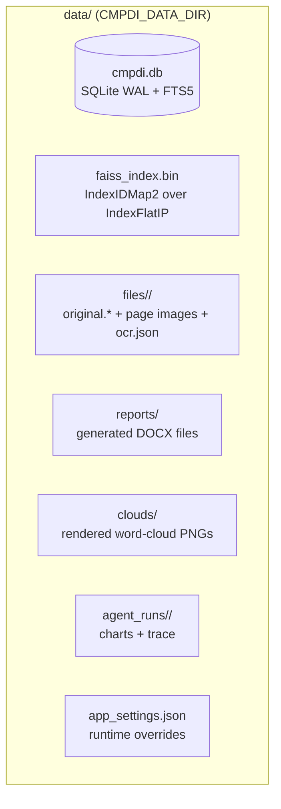
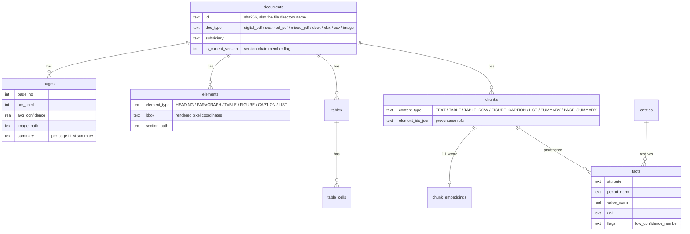
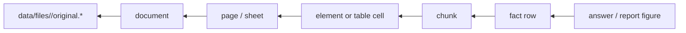

# Data Model & Provenance

One SQLite database (WAL mode) plus one file directory hold the entire system
state. The database is rebuildable; the file store is the source of truth.

Code: `backend/db/models.py` (ORM, mirrors `schema.sql`),
`backend/db/database.py` (connection, helpers, migrations),
`backend/storage/__init__.py` (file store), `backend/models/documents.py`
(parser contract).

## Storage layout

- Document id **is** the file SHA-256. `doc_dir()` resolves
  `data/files/<sha256>/`; `store_original()` writes `original.<ext>` once and
  never mutates it. Page images and OCR artifacts sit beside it.
- The FAISS index persists to `data/faiss_index.bin`; a dimension or count
  drift against the DB triggers an automatic rebuild from stored vectors.
- DB access goes through `q()` / `q1()` / `execute()` with a `?` → `:p#`
  placeholder shim; `CleanRow` maps NaN to NULL on the way out.

## Entity-relationship map

Supporting tables: `entities` (+ `entity_mentions`), `entity_reference`
(context only — never evidence), `doc_keywords`, `doc_topics`, `kg_edges`,
`conflict_status`, `jobs`, `reports`, `agent_runs`, and the FTS5 virtual table
`chunks_fts` backing BM25.

## Provenance chain

Every derived value keeps this chain. Nothing downstream ever touches the raw
file; indexes are rebuildable from the store.

Conventions that protect the chain:

- Raw values are never overwritten: `value_raw` + `value_norm`, `unit` +
  conversion provenance, `section_path` + `element_ids_json` on every chunk.
- Low-confidence OCR digits are flagged (`low_confidence_number`), searchable
  but excluded from reports/answers until corroborated or approved.
- Superseded revisions stay in the DB with `is_current_version = 0` — still
  visible, struck through, excluded from default retrieval scope.
- Deletion removes a document everywhere (vectors, chunks, facts, tags, page
  images, stored original) and elects a new current version in its group.

Next: [PIPELINE.md](PIPELINE.md) builds these rows; [RETRIEVAL.md](RETRIEVAL.md)
and [KNOWLEDGE.md](KNOWLEDGE.md) read them.
