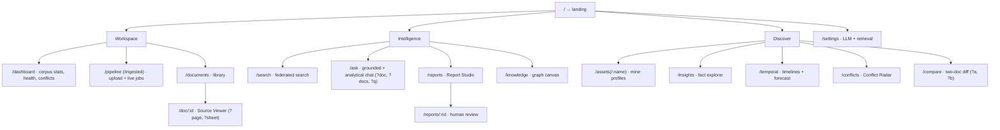
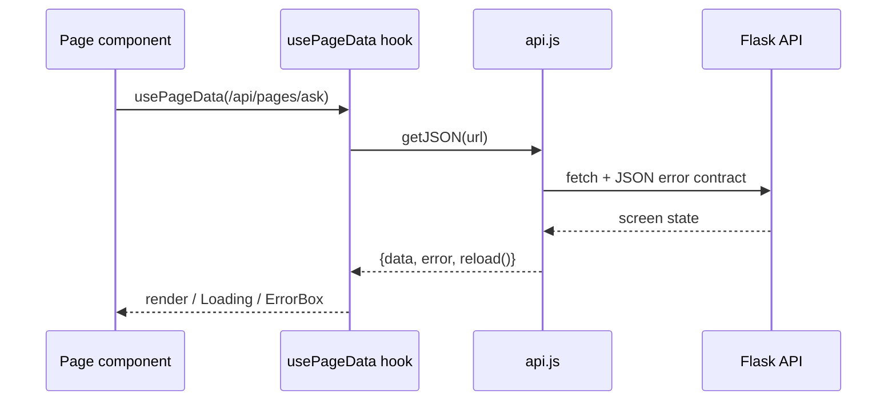

# Frontend

A React SPA (Vite + React Router + Tailwind + Motion + Lucide) built to
`frontend/dist/` and served by Flask. Backend owns all logic; components own
presentation, interaction, and client-side state.

Code: `frontend/src/` (`App.jsx`, `api.js`, `hooks/`, `layout/`,
`components/`, `pages/`).

## Routes

`App.jsx` keeps a `PANELS[]` array of `match(pathname)` predicates (no
`<Routes>`); `/` renders the marketing landing page outside `AppShell`, and
the pathname keys panel rendering so param routes re-fetch on change.

Screen data comes from `GET /api/pages/<screen>`; see `backend/api/pages.py`
for the per-screen payloads.

## Data pattern

- `api.js`: `getJSON` / `postJSON` (throw `Error(data.error …)` on non-2xx)
  and `uploadFiles` (`FormData` → `POST /api/ingest`).
- `hooks/useData.js`: `usePageData` (fetch-once + `reload`), `usePolling`
  (interval fetch with render diffing; Pipeline polls `/api/jobs`), and
  `useQueryParams`; `cmpdiColors()` reads CSS vars so canvas charts follow
  theme flips.
- Shared UI (`components/ui.jsx`): `PageHeader`, `Rise`/`Reveal` transitions,
  `Loading` (branded pulse + skeleton), `ErrorBox`. Icons are Lucide;
  animation is Motion plus local `components/motion/*` primitives.

## Layout & theme

`AppShell` (fixed sidebar `240px | 72px collapsed`, `max-w-6xl` main, footer):
Workspace (Dashboard/Pipeline/Documents) · Intelligence
(Search/Ask/Reports/Knowledge) · Discover
(Assets/Insights/Temporal/Conflicts/Compare), plus Settings, an offline
Activity badge, and theme/collapse controls. The Viewer shows the document
summary, per-page summaries above extracted content, and real previews (PDF
viewer, sheet-switchable tables, DOCX reading view, image + OCR text).
`ThemeProvider` defaults to dark, persists `cmpdi-theme`, and toggles a
transient `.theming` glide class; the sidebar stays fixed charcoal.

> Note: `pages/Topics.jsx` (word clouds, `POST /api/topics/refresh`) is
> currently unrouted in `App.jsx` — reachable only via its API endpoints
> until it is added to `PANELS`.

## Dev vs prod

- Dev: `npm run dev` in `frontend/` (Vite `:5173`, API proxied to
  `127.0.0.1:5000`); ship with `npm run build` + Flask restart.
- Prod: Flask serves `frontend/dist/` (see `backend/app/__init__.py`
  catch-all); `run.sh` rebuilds only when sources are newer than
  `dist/index.html`.

Next: [OPERATIONS.md](OPERATIONS.md) (dev loop, build, config).
