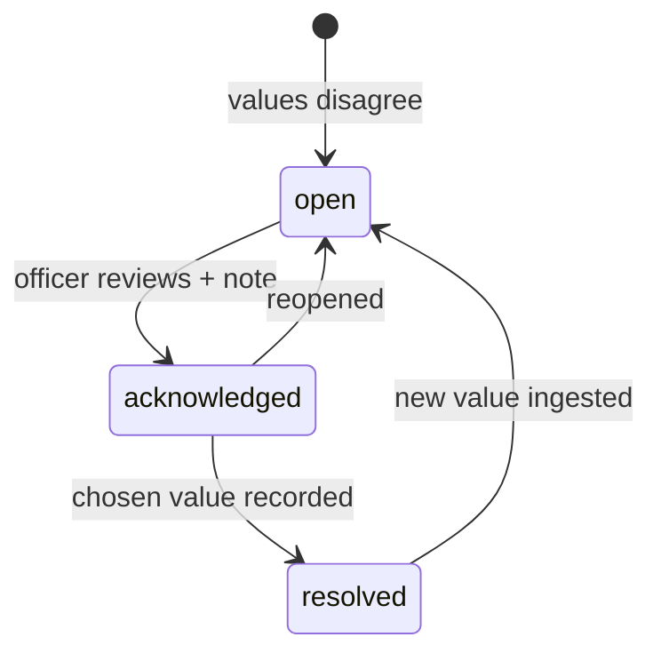

# Knowledge Layer

The fact index is the structured spine of the product. Everything here is
read-only over ingested evidence: facts, conflicts, document comparison, the
knowledge graph, asset profiles, curated reference context, topics, temporal
series, and the Insights explorer.

Code: `backend/core/knowledge/` (`facts.py`, `relations.py`, `graph.py`,
`assets.py`, `reference.py`, `reference_data.py`, `summary.py`, `topics.py`),
`backend/core/conflicts.py`, `compare.py`, `insights.py`, `temporal.py`.

## Facts

`extract_for_doc()` builds `(entity, attribute, period) → (value_norm, unit)`
rows from two paths:

- **Table rows** — row-local entity, header attribute/period, `context_unit`
  from headers or cells.
- **Prose** — quantity regex ±150-char window for entity/attribute/period,
  with noise guards (footnote markers, date cells, year spans, computed
  high-precision values) and plausibility bands per attribute (ash ≤ 100%,
  GCV in its kcal/kg band).

Subsidiary entities are seeded (`ensure_subsidiary_entities()`); mine names
are mined from the corpus with fuzzy aliasing. OCR-sourced numbers below
confidence get `conf 0.5` / `low_confidence_number`. Raw and normalized values
are always stored side by side — see [DATA_MODEL.md](DATA_MODEL.md).

## Conflict Radar

Facts group by `(entity, attribute, period, unit)` after unit normalization
(tolerance `CMPDI_CONFLICT_TOLERANCE`, default 1% relative). Distinct values
become a conflict; the system shows every value with its receipt rather than
choosing one. Chat attaches "also reported elsewhere" notes, reports flag the
slot for verification, and Insights plots each reported value per period.

`POST /api/conflicts/status {key, status}` drives the workflow (open →
acknowledged → resolved). Likely causes are explained per conflict: partial
periods, OCR uncertainty, sibling-row attribution, revised figures; superseded
and low-confidence sources are labeled, not hidden. Groups sort worst-spread
first after MT normalization.

## Compare Documents

`compare.py` diffs any two documents (version chains suggest the natural
pair): changed numerical facts, facts only in one document, and sections
added or removed. `GET /api/compare?a&b`.

## Knowledge graph

`/knowledge` renders a force-directed canvas of documents, organizations,
mines, locations, geology, metrics, events, plus extracted tags. Persisted
evidence edges (`kg_edges`, built deterministically at ingestion by
`relations.py`) carry `OPERATES / LOCATED_IN / BASED_IN / HAS_GEOLOGY /
MENTIONS / OCCURRED_AT / INVOLVES / REPORTED_IN` with chunk → page → document
provenance. `HAS_METRIC / REPORTS_METRIC` and version `SUPERSEDES` links
derive at query time from the fact index so the graph never duplicates it.
Reference context never enters the graph. Clicking a node opens its one-hop
neighbourhood (`/api/graph/node`) with per-edge receipts.

## Assets & reference context

- **Assets** (`assets.py`): every mine, coalfield, block and location gets a
  unified profile — latest key figures with receipts, median-per-period MT
  trends, mentioning documents (superseded struck through), related
  operators/places/geology by shared-document co-occurrence, open conflicts,
  recent evidence table. `GET /api/assets` (`kind=mine|region`, `q`) orders by
  fact count so the most-reported mines surface first.
- **Reference** (`reference_data.py`, `reference.py`): a curated, locally
  bundled dataset (subsidiary profiles, operating geography, dated public
  production/sector statistics) seeded idempotently at init/startup into
  `entity_reference` and served as `origin: "reference"` alongside the
  entity's `origin: "evidence"` library footprint. Context, never evidence:
  it never enters facts, conflicts, answers or reports.

## Topics, temporal, Insights

- **Topics** (`topics.py`): KeyBERT-style keyphrases + numpy KMeans /
  c-TF-IDF clusters + `wordcloud` PNGs (corpus-wide, per subsidiary, per
  year, per doc type); similar-document finder via doc-mean cosine;
  `POST /api/topics/refresh`.
- **Temporal** (`temporal.py`): per-period median timelines with receipts plus
  an OLS forecast once ≥3 periods exist.
- **Insights** (`insights.py` + `/insights` explorer): the fact index made
  visible — any metric (entity × attribute) as a receipt-backed chart, plus
  dashboard signals (YoY ≥ 30%, outlier-vs-median ≥ 50%, current-only,
  medians). Measured quality/KPI stats (processing success, high-confidence
  OCR share, quarantine-free facts, gold-set extraction accuracy, report
  timings) live here too.

Next: [AGENT_AND_REPORTS.md](AGENT_AND_REPORTS.md) (analysis and reporting
over this layer), [FRONTEND.md](FRONTEND.md) (the screens that expose it).
