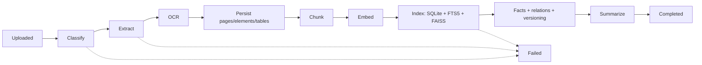
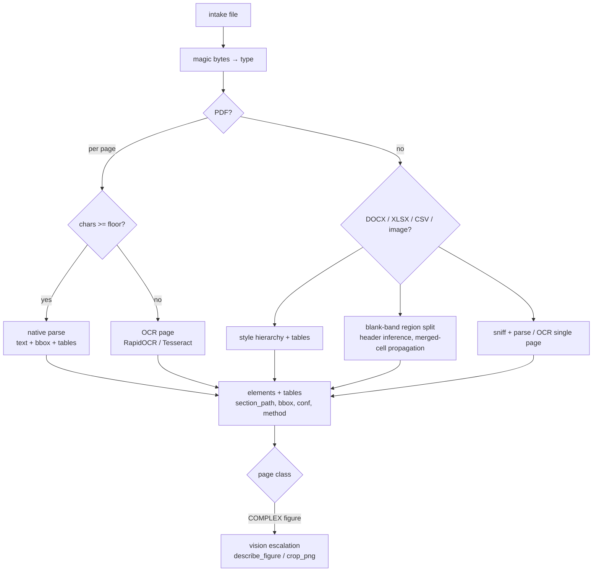
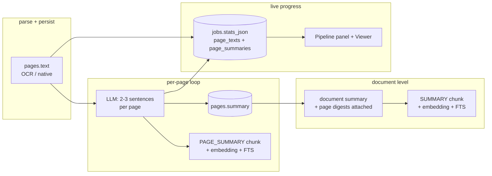

# Ingestion Pipeline

Every document moves through one stage machine in a background worker thread
(consuming the `jobs` table), so the UI stays responsive. A failed document
records its error and never crashes the queue.

Code: `backend/core/pipeline/pipeline.py` (orchestration),
`parsers.py`, `chunker.py`, `embedder.py`, `vector_store.py`,
`inspection.py`, `quality_gate.py`, `vision.py`;
summaries in `backend/core/knowledge/summary.py`;
facts/relations in `backend/core/knowledge/facts.py`, `relations.py`.

## Stage machine



| Stage | What happens | Module |
|---|---|---|
| Classify | Magic-byte type detection; digital vs scanned vs mixed PDF refined per page | `parsers.classify` |
| Extract | PyMuPDF (native text, bboxes, `find_tables`), python-docx hierarchy, openpyxl region split, CSV sniffing, image OCR | `parsers.py` |
| OCR | Pages below the text floor go to RapidOCR (or Tesseract); word confidences kept; 300 DPI re-render | `parsers.py`, `config.CMPDI_PAGE_TEXT_FLOOR` |
| Normalize | Indian number formats, lakh/crore, unit dictionary, fiscal-year spans | `backend/core/normalize.py` |
| Chunk | Section-bounded TEXT/LIST; whole tables or self-describing TABLE_ROW (header repeated); `element_ids_json` provenance | `chunker.py` |
| Embed | Local sentence-transformers (`embeddinggemma → bge-small → MiniLM`); float32 BLOBs | `embedder.py` |
| Index | SQLite rows + FTS5 + FAISS `IndexIDMap2(IndexFlatIP)` on L2-normalized vectors | `vector_store.py` |
| Enrich | Fact extraction, relation edges, doc-mean cosine version grouping (>0.95), quality gate, keyword tags | `knowledge/`, `quality_gate.py` |
| Summarize | Per-page LLM summaries → document summary; each indexed as searchable chunks | `knowledge/summary.py` |

## Parser decisions



- Two-column reading order is resolved from block coordinates; repeated
  top/bottom bands are stripped as page furniture, not body text.
- XLSX reads cached values (`data_only=True`), keeps formula strings as
  metadata; units are parsed from headers *and* cells.
- `inspection.py` assigns a zero-render page class
  (`TEXT_ONLY | IMAGE_ONLY | COMPLEX …`) and a per-page plan; `vision.py`
  escalates figure-heavy pages to the configured vision-capable LLM.

## Chunk contract

Chunk types: `TEXT | TABLE | TABLE_ROW | FIGURE_CAPTION | LIST | SUMMARY |
PAGE_SUMMARY`. Rules: never split a table row, never mix sections in one
chunk, repeat header context in every row chunk so each is self-describing:

```text
TABLE [Doc: Annual Report 2022, p.47] | Mine | FY | Production (Mt) | … | Kusunda | 2021-22 | 4.85 |
```

## Bottom-up summaries



Long PDFs are capped at `MAX_LLM_PAGES`; the rest (and everything in
extractive mode) fall back to first-sentences summaries. Raw page text and
finished summaries stream into `jobs.stats_json`, which the Pipeline screen
polls for its per-page OCR/summary panel.

## Deletion & versions

`delete_document()` removes vectors, chunks, facts, tags, page images and the
stored original, then elects a new current document in the version group.

Next: [RETRIEVAL.md](RETRIEVAL.md) (searching these chunks),
[KNOWLEDGE.md](KNOWLEDGE.md) (facts, conflicts, graph).
