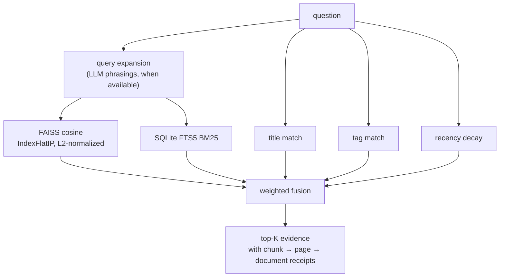
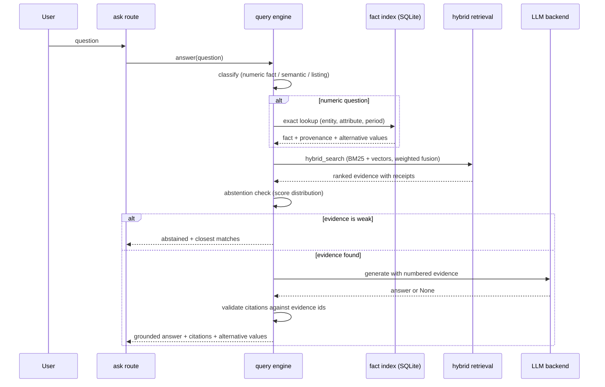

# Retrieval & Grounded Q&A

Hybrid search plus a query engine that answers from evidence, abstains when
evidence is weak, and never lets generation alter an exact number.

Code: `backend/core/retrieval/__init__.py` (fusion),
`query.py` (routing, RAG, abstention), `keywords.py`, `org_search.py`;
evidence grading in `backend/core/quality/trust.py`;
chat route in `backend/api/chat.py`.

## Fusion

Candidates come from three layers and merge into one weighted score. Library
filters (type, subsidiary, tag, reporting-period range, current-versions-only)
apply *inside* both retrieval layers, before scoring.

| Signal | Weight | Source |
|---|---|---|
| Vector similarity | 0.45 | FAISS cosine |
| BM25 | 0.25 | SQLite FTS5 (+ LLM expansions) |
| Title match | 0.15 | Query terms in filename/title |
| Tag match | 0.10 | Query terms vs extracted keywords |
| Recency | 0.05 | Exponential decay on document date |

Tags come from a dual-layer extractor at ingestion (Ollama prompt when a
generative model exists, deterministic term-frequency fallback otherwise) and
also enrich the indexed embeddings.

## Query flow

`/ask` sends the message list to `POST /api/chat`. Follow-ups ("which
document says that?") are rewritten into standalone queries from history, then
routed. Analytical intents (compare, trend, share, rank, "chart …") skip this
path and go to the agent — see [AGENT_AND_REPORTS.md](AGENT_AND_REPORTS.md).

Rules:

- **Numeric questions** resolve deterministically from the fact index. The
  composed answer quotes the extracted value and its receipt — no LLM step
  can alter it. Conflicting values are attached, never averaged.
- **Semantic questions** generate with numbered evidence; every citation is
  validated against the evidence ids provided in the prompt.
- **Abstention** is a first-class outcome: below the score floor the system
  says what it searched and shows the closest matches instead of guessing.
- LLM provider resolution (`CMPDI_LLM_PROVIDER`, also settable in Settings):
  Ollama → OpenAI-compatible → local Hugging Face → extractive mode (verbatim
  evidence, no generation). Generation never blocks an answer.

## Evidence quality

Every answer carries an Evidence Quality grade (`HIGH / MEDIUM / LOW`) from
`trust.grade()` — source count, independent documents, conflicts touched, OCR
provenance, exact fact match — plus the checks that justify it and a "Why
this answer?" reasoning trail. Ask can be scoped to one document or a
selection via `?doc=` / `?docs=` / `?q=`.

## Organization search

`/search` (and `/api/search/organization`) returns the hybrid document results
plus five read-only sections assembled from the existing knowledge layer
(`org_search.py`, no new extraction): matching numeric **facts** (each with a
receipt), **entities**, **locations**, **metrics**, and external **reference**
rows labeled `origin: "reference"` — context, never evidence.

Next: [KNOWLEDGE.md](KNOWLEDGE.md) (the fact index and everything built on
it), [AGENT_AND_REPORTS.md](AGENT_AND_REPORTS.md) (analytical questions).
